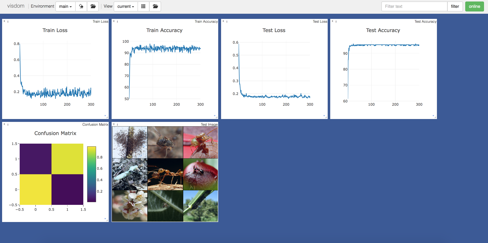

# CapsuleTL
Capsule Transfer Learning

## Requirements
* [Anaconda](https://www.anaconda.com/download/)
* PyTorch
```
conda install pytorch torchvision -c pytorch
```
* PyTorchNet
```
pip install git+https://github.com/pytorch/tnt.git@master
```
* capsule-layer
```
pip install git+https://github.com/leftthomas/CapsuleLayer.git@master
```
* tqdm
```
conda install tqdm
```

## Usage
```
python -m visdom.server -logging_level WARNING & python main.py --data_type CIFAR10 --net_mode CNN --num_epochs 300
optional arguments:
--data_type                   dataset type [default value is 'MNIST'](choices:['MNIST', 'FashionMNIST', 'SVHN', 'CIFAR10', 'CIFAR100', 'STL10'])
--net_mode                    network mode [default value is 'Capsule'](choices:['Capsule', 'CNN'])
--routing_type                routing type [default value is 'k_means'](choices:['k_means', 'dynamic'])
--cum                         accumulate similarity, it only work for dynamic routing [default value is False]
--num_iterations              routing iterations number [default value is 3]
--batch_size                  train batch size [default value is 50]
--num_epochs                  train epochs number [default value is 100]
```
Visdom now can be accessed by going to `127.0.0.1:8097/env/$data_type` in your browser, 
`$data_type` means the dataset type which you are training.

## Results
The train loss、accuracy, test loss、accuracy, and confusion matrix are showed with visdom,
the best test accuracy is ~ 95.72%.

