# PSCapsNet
A PyTorch implementation of Parameter-sharing Capsule Network based on the paper [Parameter-sharing capsule with k-means routing]().

## Requirements
* [Anaconda](https://www.anaconda.com/download/)
* PyTorch
```
conda install pytorch torchvision -c pytorch
```
* PyTorchNet
```
pip install git+https://github.com/pytorch/tnt.git@master
```
* capsule-layer
```
pip install git+https://github.com/leftthomas/CapsuleLayer.git@master
```

## Datasets
We have uploaded the datasets into [BaiduYun](https://pan.baidu.com/s/1El-gfQUsCSk1Rllp6F0gqw) and 
[GoogleDrive](https://drive.google.com/open?id=1drHvobmckZvul60tnrpFhvdwlPUd_DcS). 

You needn't download the datasets by yourself, the code will download them automatically.
If you encounter network issues, you can download all the datasets from the aforementioned cloud storage webs, 
and extract them into `data` directory.

## Usage

### Train model
```
python -m visdom.server -logging_level WARNING & python main.py --data_type CIFAR10 --net_mode CNN --num_epochs 300
optional arguments:
--data_type                dataset type [default value is 'MNIST'](choices:['MNIST', 'FashionMNIST', 'SVHN', 'CIFAR10', 'STL10'])
--net_mode                 network mode [default value is 'Capsule'](choices:['Capsule', 'CNN'])
--use_da                   use data augmentation or not [default value is False]
--routing_type             routing type [default value is 'k_means'](choices:['k_means', 'dynamic'])
--num_iterations           routing iterations number [default value is 3]
--batch_size               train batch size [default value is 50]
--num_epochs               train epochs number [default value is 100]
```
Visdom now can be accessed by going to `127.0.0.1:8097/env/$data_type` in your browser, 
`$data_type` means the dataset type which you are training. If you want to interrupt 
this process, just type `ps aux | grep visdom` to find the `PID`, then `kill -9 PID`.

### ProbAM visualization
```
python vis.py --data_type CIFAR10 
optional arguments:
--data_type                dataset type [default value is 'STL10'](choices:['MNIST', 'FashionMNIST', 'SVHN', 'CIFAR10', 'STL10'])
--data_mode                visualized data mode [default value is 'test_single'](choices:['test_single', 'test_multi'])
--model_name               model epoch name [default value is 'STL10_Capsule.pth']
```
Generated ProbAM results are on the same directory with `README.md`.

### Generate figures
```
python gen_figures.py
```
Generated figures are on the same directory with `README.md`.

## Results
The train loss、accuracy, test loss、accuracy and confusion matrix are showed on visdom.

### MNIST
- Capsule

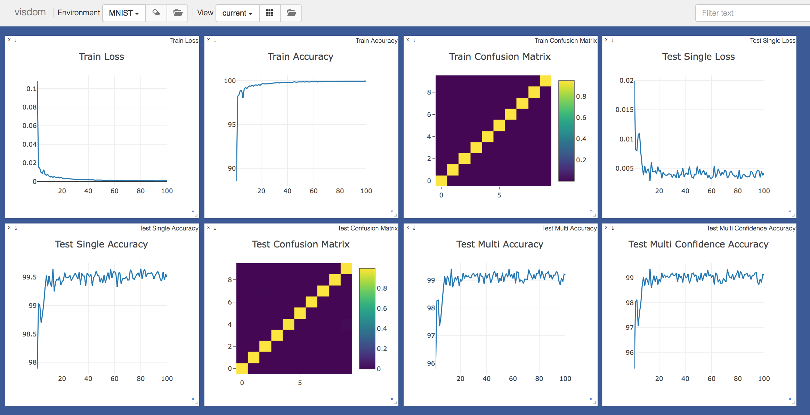

- CNN

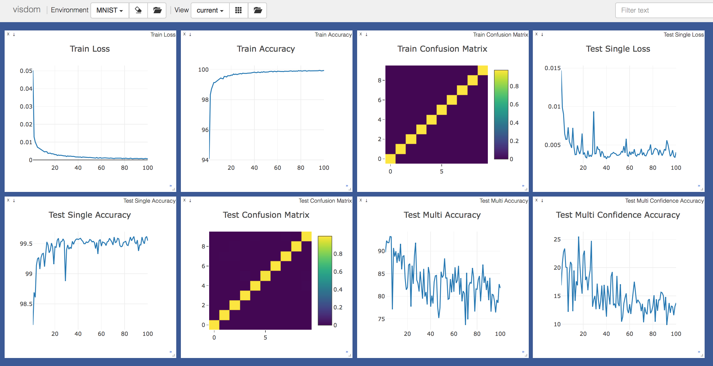

### FashionMNIST
- Capsule


- CNN

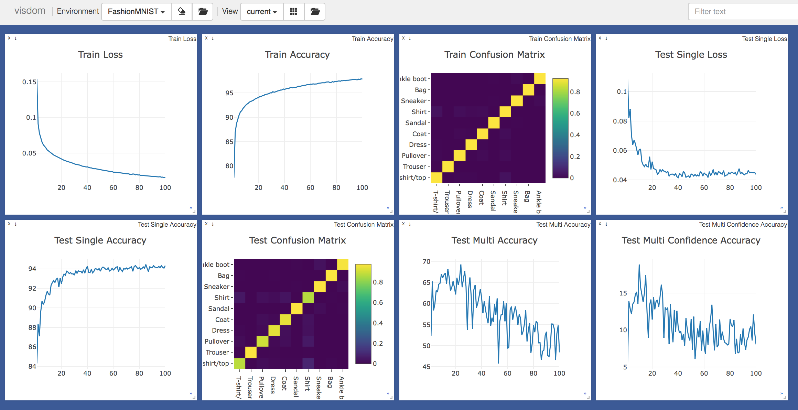

### SVHN
- Capsule

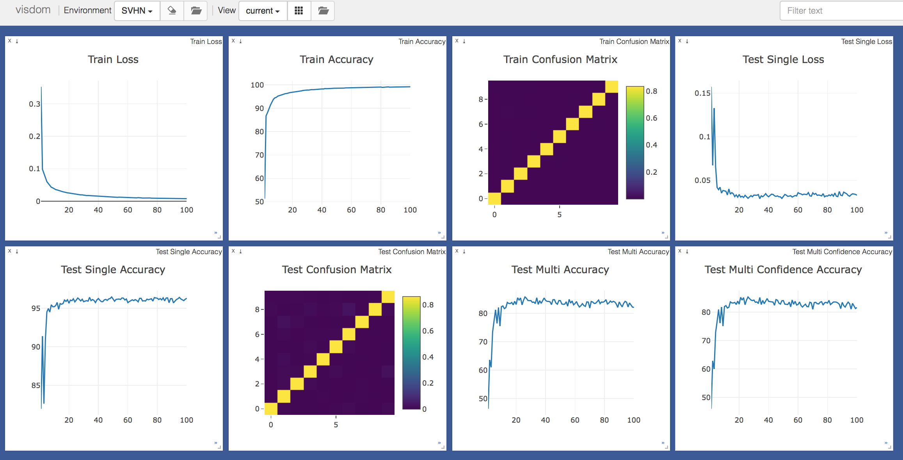

- CNN

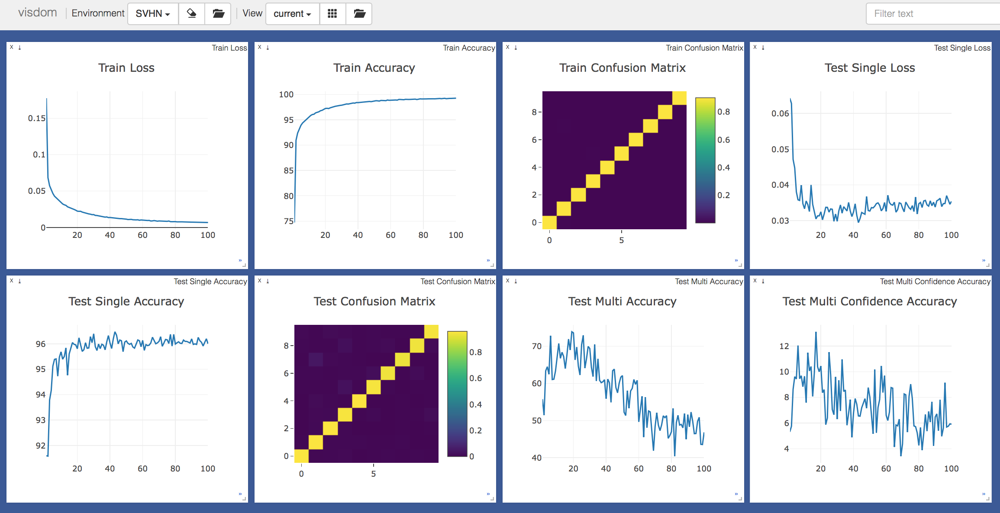

### CIFAR10
- Capsule

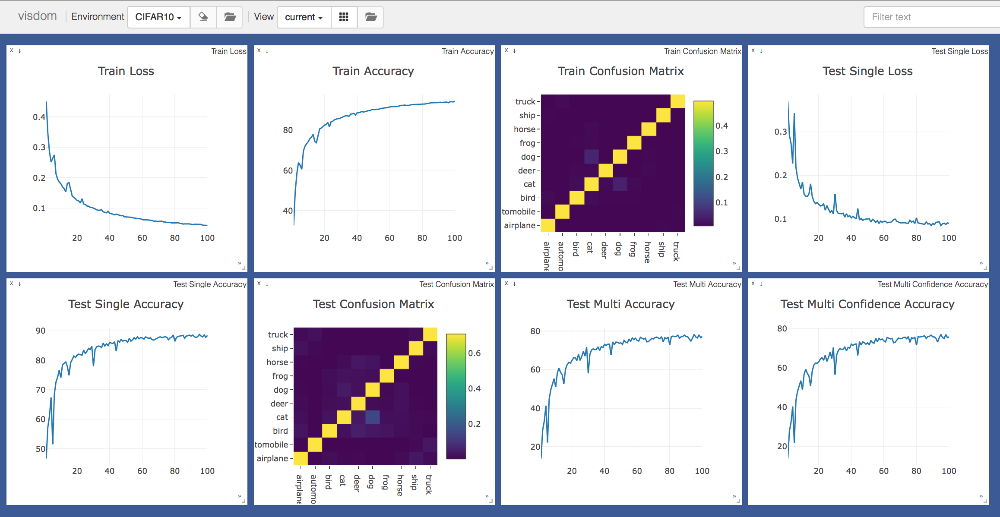

- CNN

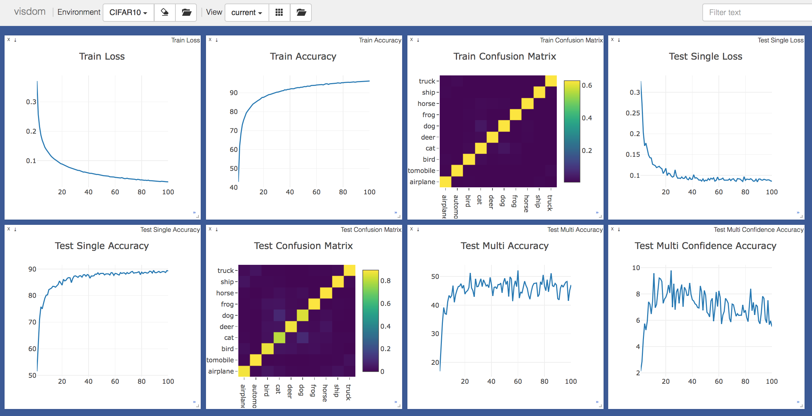

### STL10
- Capsule

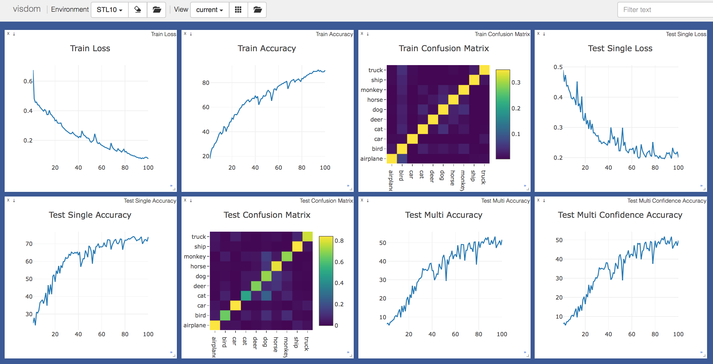

- CNN

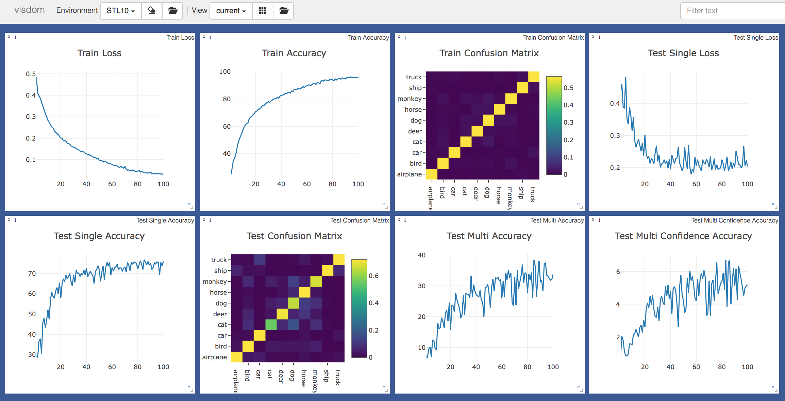


### ProbAM 
- Single label image

| Original | Conv1 | Feature Map | 
| :-: | :-: | :-: | 
| 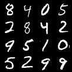 | 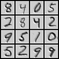| 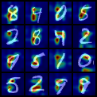 | 
|  | 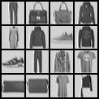| 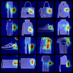 | 
| 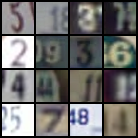 | 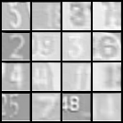|  | 
|  | 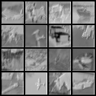| 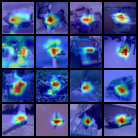 | 
|  | | 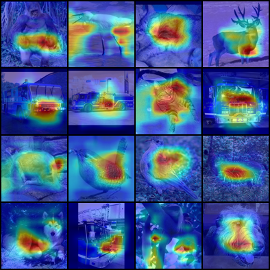 | 

- Multi-label image

| Original | Conv1 | Feature Map | 
| :-: | :-: | :-: | 
| 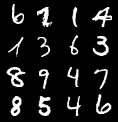 | 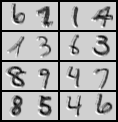| 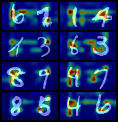 | 
|  | 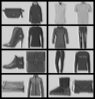| 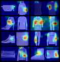 | 
| 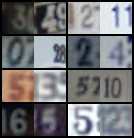 | 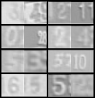| 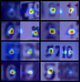 | 
| 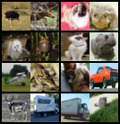 | 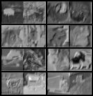| 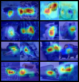 | 
| 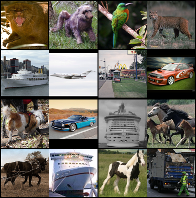 | 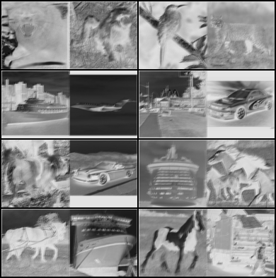| 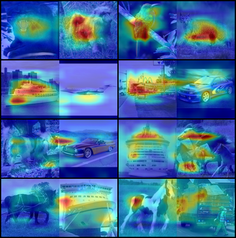 | 
